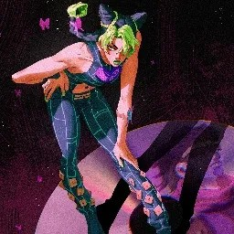

<h1 align="center">
    
</h1>

<p align="center">
  <i align="center">An Open Source Discord Bot - Fully Customisable and Free✨</i>
</p>

<h4 align="center">
  <a>
    
  </a>
  <a>
    
  </a>
  <a>
    
  </a>
  <a>
    
  </a>
</h4>

<h4 align="center">
  
</h4>

<p align="center">
  <a href="#overview">Overview</a> •
  <a href="#installation">Installation</a> •
  <a href="#contributing">Contributing</a> •
  <a href="#special-thanks">Special Thanks</a> •
  <a href="#license">License</a>
</p>

## Overview

**SnapBot** is a multi-purpose Discord bot created using `discord.py`. It's designed primarily for [The Attic](https://discord.gg/attic) Discord Server but can be built from source to work for other servers.

<details>
  <summary><b>Features</b></summary>

### General Utility Features

1. **Color Command:**
    
    - Get and create color roles
    - Manage and customize color roles for users

2. **User Reporting Feature:**

    - Report users for rule violations
    - Admins can review and manage reports
    
3. **Anonymous Confessions:**

    - Post anonymous confessions in the server
    - Ensures user anonymity while sharing their thoughts
    
4. **Urban Dictionary on Discord:**

    - Look up definitions & examples from Urban Dictionary
    - Provides quick access to slang and modern terminology
    
5. **Away from Keyboard:**

    - Set your status to AFK in the server
    - Inform others of your unavailability automatically
    
6. **Mimic other Members:**

    - Mimic other users using the `mimic` command.
    - Fun and interactive way to imitate others in chat
    
7. **Avatar Command:**

    - Display other users' avatars using the `avatar` command
    - View profile pictures of other server members easily
    
</details>

## Installation

1. **Clone the Repository:**

```bash
git clone https://github.com/kish7105/Snapbot.git
cd SnapBot
git switch stable  # Switch to the stable branch( DO NOT USE THE MAIN BRANCH FOR SETUP )
```

2. **Create a virtual environment and activate it( Optional but Recommended):**

```bash
python -m venv venv
venv\Scripts\activate  # For Windows
venv/bin/activate  # For MacOS & Linux
```

3. **Install Dependencies:**

```bash
pip install -r requirements.txt
```

4. **Configuration Setup:** Create a `.env` file inside the `snapbot/data/` directory with the following contents:

```bash
BOT_TOKEN="your-bot-token"
MONGODB_CONNECTION_STRING="your-mongodb-connection-string"
# To generate this, look up how to generate a fernet key using the cryptography module in python.
ENCRYPTION_KEY="your-encryption-key-here"
```

5. **Edit the config.toml file:** Rename the `config_example.toml` file to `config.toml` inside the `snapbot/data/` directory and fill in the values based on your discord server configurations.

## Contributing

We welcome contributions from the community to make SnapBot better! Here are some ways you can contribute:

1. **Reporting Bugs**: If you find a bug, please open an issue on GitHub.

2. **Requesting Features**: If you have an idea for a new feature, please let us know by opening an issue.

3. **Submitting Pull Requests**: If you want to contribute code, fork the repository and submit a pull request with your changes.

<br>
<a href="https://github.com/kish7105/SnapBot/graphs/contributors">
  
</a>

## Special Thanks

A heartfelt thank you to the amazing members of [The Attic](https://discord.gg/attic) Discord server. Your support and encouragement have been invaluable to the success of this project. Whether through sharing insights, providing feedback, or simply being a sounding board, you've made a significant difference.

### To Each of You

Every one of you has contributed uniquely to this journey, and I couldn't have come this far without you. Your presence and contributions remind us of the power of community and collaboration.

Thank you for being a part of this incredible journey. Your support is deeply appreciated, and I look forward to many more milestones together💖

<table>
  <tr>
    <td align="center">
      
      <br />
      <sub><b>Dance</b></sub>
    </td>
    <td align="center">
      
      <br />
      <sub><b>Shuu</b></sub>
    </td>
    <td align="center">
      
      <br />
      <sub><b>Riverrr</b></sub>
    </td>
    <td align="center">
      
      <br />
      <sub><b>Amen</b></sub>
    </td>
    <td align="center">
      
      <br />
      <sub><b>Muteki</b></sub>
    </td>
  </tr>
  <tr>
    <td align="center">
      
      <br />
      <sub><b>aayu</b></sub>
    </td>
    <td align="center">
      
      <br />
      <sub><b>Eve</b></sub>
    </td>
    <td align="center">
      
      <br />
      <sub><b>Home</b></sub>
    </td>
    <td align="center">
      
      <br />
      <sub><b>Baaka</b></sub>
    </td>
    <td align="center">
      
      <br />
      <sub><b>Manno</b></sub>
    </td>
  </tr>
  <tr>
    <td align="center">
      
      <br />
      <sub><b>Mr. Jelly</b></sub>
    </td>
    <td align="center">
      
      <br />
      <sub><b>https.m00n</b></sub>
    </td>
  </td>
</table>
  

## License

Check out the [LICENSE](./LICENSE) file for more details.

## Made with 💖 By
<table>
  <tr>
    <td align="center">
      
      <br />
      <sub><b>kishh</b></sub>
    </td>
  </tr>
</table>

---

